Project Code - Analysis of youth runaways in Allegheny County
================
Aiswariya Raja
9/22/2018

``` r
#Importing dataset into R
setwd("~/allegheny-county-runaway-youth-analysis")
cny <- read.csv("AnalyticExcercise_20180214.csv")
```

``` r
nrow(cny)
```

    ## [1] 2849

``` r
cny<- transform(cny,
                RUNS = as.factor(mapvalues(RUNS,c(1,0),c("Runaway","Not Runaway"))),
                SPELLONE = as.factor(mapvalues(SPELLONE,c(1,0),c("First Spell","Not First Spell"))),
                INYEAR = as.factor(mapvalues(INYEAR, c(2014,2015,2016),c("2014","2015","2016"))),  
                LEVELCHG = as.factor(mapvalues(LEVELCHG, c(0,1),c("0","1"))),
                DISCH = as.factor(mapvalues(DISCH, c(0,1),c("0","1"))),
                REENTER = as.factor(mapvalues(REENTER, c(0,1),c("0","1"))),
                NPLACES = as.factor(mapvalues(NPLACES, c(1,2,3,4,5,6,7,8,9,11,13),c("1","2","3","4","5","6","7","8","9","11","13"))),
                MOVES = as.factor(mapvalues(MOVES, c(0,1,2,3,4,5,6,7,8,10,12),c("0","1","2","3","4","5","6","7","8","10","12"))),
                AGECAT7 = as.factor(mapvalues(AGECAT7, c(1,2,3,4,5,6,7,8), c("0 years","1-2 years","3-5 years", "6-8 years","9-11 years","12-14 years","15-17 years","18-23 years"))),
                DURCAT = as.factor(mapvalues(DURCAT, c(1,2,3,4,5,6), c("1-29 days","30-89 days","90-179 days", "180-364 days","365-544 days","545-1094 days"))), 
                TYPE = as.factor(mapvalues(TYPE, c("AL","FC","GH","IL","KC","RC", "RT","SF","SG","UK"), c("Alternative Placement","Foster Care","Group Home", "Independent Living","Kinship Care","Residential Care","Residential Treatment Facilities","Shelter Foster Care","Shelter Group Home","Unknown"))),
                IM = as.factor(mapvalues(IM, c(1,2,3,4,5,6,7,8,9,10,11,12),c("Jan","Feb","Mar","Apr","May","Jun","Jul","Aug","Sep","Oct","Nov","Dec"))),
                IY = as.factor(mapvalues(IY,c(2014,2015,2016),c("2014","2015","2016"))),
                OM = as.factor(mapvalues(OM, c(1,2,3,4,5,6,7,8,9,10,11,12),c("Jan","Feb","Mar","Apr","May","Jun","Jul","Aug","Sep","Oct","Nov","Dec"))),
                OY = as.factor(mapvalues(OY,c(2014,2015,2016,2017),c("2014","2015","2016","2017"))),
                EXIT = as.factor(mapvalues(EXIT, c("XCA","XJP","XLC","XOP","XOT","XRF", "XRL","XRM","XRY","XUK","ZTC"), c("Completed adoption","Exit to JPO","Permanent Legal Custodianship", "Other Permanent Living Arrangement","Other","Reunification","Exit to relatives ","Reach majority","Runaway","Unknown","Still in care"))))
```

**INTRODUCTION** Data Demographics:

``` r
#GENDER
gender.prop.table <-round(prop.table(table(cny$GENDER)),2)
gender.table<- table(cny$GENDER)
gender.table
```

    ## 
    ##    F    M 
    ## 1395 1454

``` r
round(prop.table(gender.table),2)
```

    ## 
    ##    F    M 
    ## 0.49 0.51

``` r
barplot(gender.table, ylab = "Number of children", col="steelblue")
```

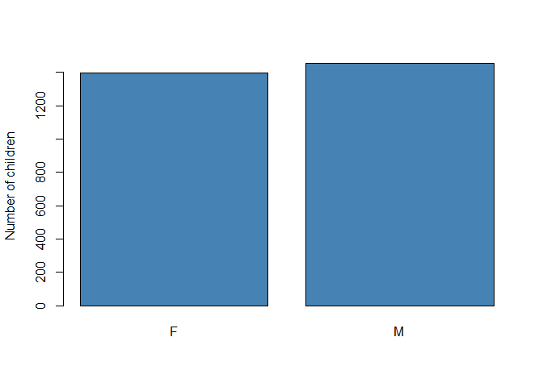<!-- -->

``` r
#HISPANIC
hispanic.table <- table(cny$HISPANIC)
hispanic.table
```

    ## 
    ##    N    U    Y 
    ## 2105  650   94

``` r
round(prop.table(hispanic.table),2)
```

    ## 
    ##    N    U    Y 
    ## 0.74 0.23 0.03

``` r
barplot(hispanic.table, ylab = "Number of children", col="steelblue")
```

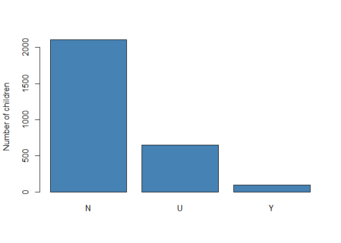<!-- -->

``` r
#ETHNIC2
ethnic2.table <- table(cny$ETHNIC2)
ethnic2.table
```

    ## 
    ##   BL   OT   WH 
    ## 1243  610  996

``` r
round(prop.table(ethnic2.table),2)
```

    ## 
    ##   BL   OT   WH 
    ## 0.44 0.21 0.35

``` r
barplot(ethnic2.table, ylab = "Number of children", col="steelblue")
```

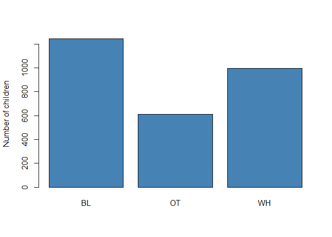<!-- -->

``` r
#AGE CATEGORY
agecat.table <- table(cny$AGECAT7)
agecat.table
```

    ## 
    ##     0 years   1-2 years 12-14 years 15-17 years 18-23 years   3-5 years 
    ##         582         397         376         457          20         440 
    ##   6-8 years  9-11 years 
    ##         314         263

``` r
round(prop.table(agecat.table),2)
```

    ## 
    ##     0 years   1-2 years 12-14 years 15-17 years 18-23 years   3-5 years 
    ##        0.20        0.14        0.13        0.16        0.01        0.15 
    ##   6-8 years  9-11 years 
    ##        0.11        0.09

``` r
barplot(agecat.table, ylab = "Number of children", col="steelblue")
```

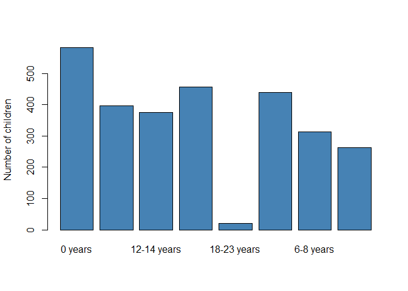<!-- -->

``` r
#SPELL AGE
spellage.table <- table(cny$SPELLAGE)
spellage.table
```

    ## 
    ##   0   1   2   3   4   5   6   7   8   9  10  11  12  13  14  15  16  17  18  19 
    ## 549 220 197 169 151 124 114 105 101  83  96  82  73 110 153 173 196 129  15   4 
    ##  20 
    ##   5

``` r
round(prop.table(spellage.table),2)
```

    ## 
    ##    0    1    2    3    4    5    6    7    8    9   10   11   12   13   14   15 
    ## 0.19 0.08 0.07 0.06 0.05 0.04 0.04 0.04 0.04 0.03 0.03 0.03 0.03 0.04 0.05 0.06 
    ##   16   17   18   19   20 
    ## 0.07 0.05 0.01 0.00 0.00

``` r
barplot(spellage.table, ylab = "Number of children", col="steelblue")
```

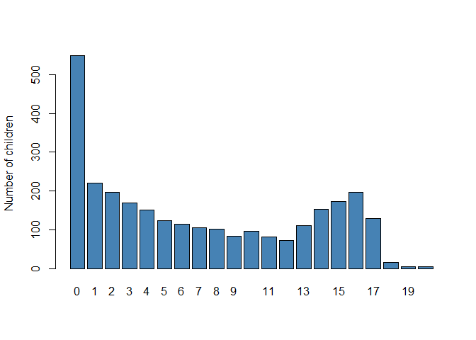<!-- -->

``` r
#INYEAR
inyear.table <- table(cny$INYEAR)
inyear.table
```

    ## 
    ## 2014 2015 2016 
    ##  982  969  898

``` r
round(prop.table(inyear.table),2)
```

    ## 
    ## 2014 2015 2016 
    ## 0.34 0.34 0.32

``` r
barplot(inyear.table, ylab = "Number of children", col="steelblue")
```

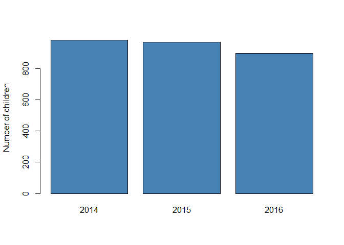<!-- -->

``` r
type_freqtable <- sort(table(cny$TYPE))
type_df <- as.data.frame(type_freqtable)
round(prop.table(type_freqtable),2)
```

    ## 
    ## Residential Treatment Facilities               Independent Living 
    ##                             0.01                             0.01 
    ##                               MX            Alternative Placement 
    ##                             0.01                             0.02 
    ##                 Residential Care                          Unknown 
    ##                             0.02                             0.02 
    ##                       Group Home              Shelter Foster Care 
    ##                             0.03                             0.09 
    ##               Shelter Group Home                      Foster Care 
    ##                             0.10                             0.16 
    ##                     Kinship Care 
    ##                             0.53

``` r
colnames(type_df) <- c("Placement Type", "Number of Children")
type_df
```

    ##                      Placement Type Number of Children
    ## 1  Residential Treatment Facilities                 15
    ## 2                Independent Living                 20
    ## 3                                MX                 32
    ## 4             Alternative Placement                 48
    ## 5                  Residential Care                 52
    ## 6                           Unknown                 64
    ## 7                        Group Home                 85
    ## 8               Shelter Foster Care                268
    ## 9                Shelter Group Home                281
    ## 10                      Foster Care                470
    ## 11                     Kinship Care               1514

``` r
ggplot(data = type_df, aes(x=`Placement Type`, y=`Number of Children`)) +geom_bar(stat="identity", fill="steelblue") + coord_flip() 
```

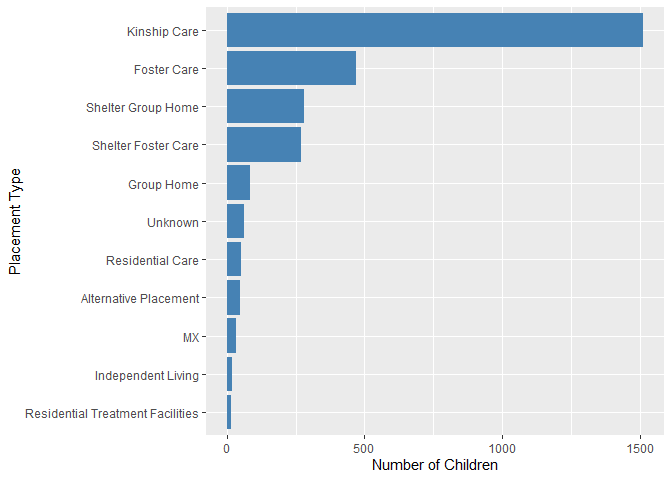<!-- -->

Distribution of children across

``` r
exit_freqtable <- sort(table(cny$EXIT))
exit_df <- as.data.frame(exit_freqtable)
round(prop.table(exit_freqtable),2)
```

    ## 
    ##                            Unknown                 Exit to relatives  
    ##                               0.00                               0.00 
    ## Other Permanent Living Arrangement                     Reach majority 
    ##                               0.00                               0.01 
    ##                              Other                        Exit to JPO 
    ##                               0.01                               0.01 
    ##                            Runaway      Permanent Legal Custodianship 
    ##                               0.04                               0.04 
    ##                 Completed adoption                      Still in care 
    ##                               0.04                               0.37 
    ##                      Reunification 
    ##                               0.46

``` r
colnames(exit_df) <- c("Exit Type", "Count")
exit_df
```

    ##                             Exit Type Count
    ## 1                             Unknown    10
    ## 2                  Exit to relatives     13
    ## 3  Other Permanent Living Arrangement    14
    ## 4                      Reach majority    19
    ## 5                               Other    36
    ## 6                         Exit to JPO    41
    ## 7                             Runaway   113
    ## 8       Permanent Legal Custodianship   116
    ## 9                  Completed adoption   119
    ## 10                      Still in care  1062
    ## 11                      Reunification  1306

``` r
ggplot(data = exit_df, aes(x=`Exit Type`, y=Count)) + geom_bar(stat="identity", fill="steelblue") + coord_flip()
```

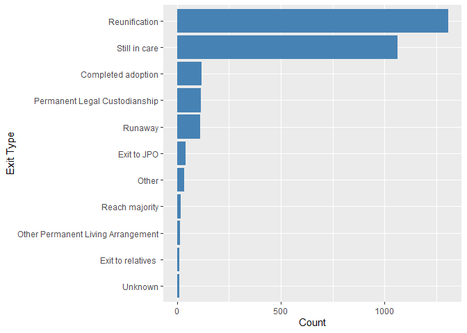<!-- -->

``` r
#AGE CATEGORY
agecat.table <- table(cny$AGECAT7)
agecat.table
```

    ## 
    ##     0 years   1-2 years 12-14 years 15-17 years 18-23 years   3-5 years 
    ##         582         397         376         457          20         440 
    ##   6-8 years  9-11 years 
    ##         314         263

**ANALYSIS** Research Question: What is the differentiating factor in
this dataset between children who run away and those who do not.

**Part 1: Statistically Significant Predictors of runaways vs not
runaways (T-tests)**

1.  Is Age a statisitcally significant predictor of runaway?

``` r
#t-test to see if age is a significant predictor of children who runaway
age.t.test <- t.test(AGE_20161231 ~ RUNS, data = cny)
age.t.test
```

    ## 
    ##  Welch Two Sample t-test
    ## 
    ## data:  AGE_20161231 by RUNS
    ## t = -51.951, df = 324.48, p-value < 2.2e-16
    ## alternative hypothesis: true difference in means is not equal to 0
    ## 95 percent confidence interval:
    ##  -9.584570 -8.885155
    ## sample estimates:
    ## mean in group Not Runaway     mean in group Runaway 
    ##                  8.039474                 17.274336

``` r
age.xry.table <- table (cny$AGE_20161231, cny$RUNS)
#Boxplot showing mean age by runaway status
age.xry.plot <- ggplot(data = cny, aes(x = RUNS, y = AGE_20161231, fill = RUNS))
age.xry.plot + geom_boxplot(stat = "boxplot") + ggtitle("Average Age Difference by Runaway Status") + xlab("Runaway Status") +  theme(text = element_text(size=12)) +ylab("Age(as of Dec2016)")
```

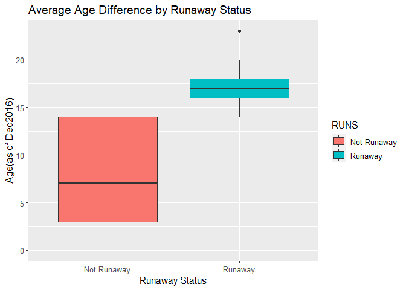<!-- -->

2.  Is Age at the beginning of spell a significant predictor of runaway?

``` r
spellage.t.test <- t.test(SPELLAGE ~ RUNS, data = cny)
spellage.t.test
```

    ## 
    ##  Welch Two Sample t-test
    ## 
    ## data:  SPELLAGE by RUNS
    ## t = -53.738, df = 367.61, p-value < 2.2e-16
    ## alternative hypothesis: true difference in means is not equal to 0
    ## 95 percent confidence interval:
    ##  -9.273133 -8.618428
    ## sample estimates:
    ## mean in group Not Runaway     mean in group Runaway 
    ##                  6.664839                 15.610619

``` r
#Boxplot showing mean age by runaway status
spellage.xry.plot <- ggplot(data = cny, aes(x = RUNS, y = SPELLAGE, fill = RUNS))
spellage.xry.plot + geom_boxplot(stat = "boxplot") + ggtitle("Average Age at the beginning of Spell by Runaway Status") + xlab("Runaway Status") +
ylab("Beginning of Spell Age")
```

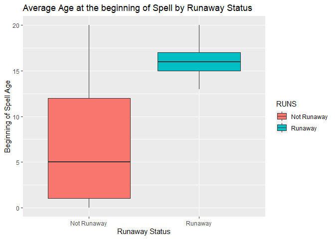<!-- -->

3.  Is Spell Duration a statistically significant predictor of runaway?

``` r
#t-test to see if spell duration in days is a significant predictor of children who runaway
spelldays.t.test <- t.test(DURAT ~ RUNS, data = cny)
spelldays.t.test
```

    ## 
    ##  Welch Two Sample t-test
    ## 
    ## data:  DURAT by RUNS
    ## t = 7.2564, df = 133.53, p-value = 2.925e-11
    ## alternative hypothesis: true difference in means is not equal to 0
    ## 95 percent confidence interval:
    ##   87.84092 153.66949
    ## sample estimates:
    ## mean in group Not Runaway     mean in group Runaway 
    ##                  248.8702                  128.1150

``` r
#Boxplot showing mean spell days by runaway status
spelldays.plot <- ggplot(data = cny, aes(x = RUNS, y = DURAT, fill = RUNS))
spelldays.plot + geom_boxplot(stat = "boxplot") + ggtitle("Spell Days by Runaway Status") + xlab("Runaway Status") +
ylab("Spell Duration (in days)")
```

<!-- -->

``` r
#t-test to see if spell duration in days is a significant predictor of children who runaway
spellmonths.t.test <- t.test(DURMO ~ RUNS, data = cny)
spellmonths.t.test
```

    ## 
    ##  Welch Two Sample t-test
    ## 
    ## data:  DURMO by RUNS
    ## t = 7.2564, df = 133.53, p-value = 2.925e-11
    ## alternative hypothesis: true difference in means is not equal to 0
    ## 95 percent confidence interval:
    ##  2.880030 5.038344
    ## sample estimates:
    ## mean in group Not Runaway     mean in group Runaway 
    ##                  8.159680                  4.200493

``` r
#Boxplot showing mean spell months by runaway status
spellmonths.plot <- ggplot(data = cny, aes(x = RUNS, y = DURMO, fill = RUNS))
spellmonths.plot + geom_boxplot(stat = "boxplot") + ggtitle("Spell Months by Runaway Status") + xlab("Runaway Status") +
ylab("Spell Duration (in months)")
```

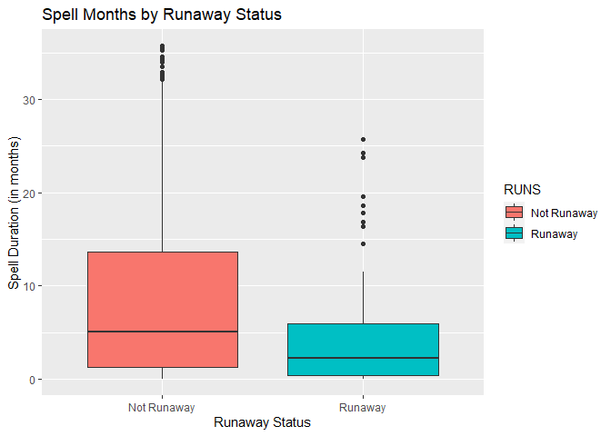<!-- -->

**Part 2:** I now want to understand the background of children of
children who are runaways. To do this, I will create a subset of the
dataset to extract the records of XRY cases.

``` r
#Subset of Only Runaway Children
cny.xry <- filter(cny, EXIT == "Runaway")
nrow(cny.xry)
```

    ## [1] 113

\#Child-specific fields Gender: Dependent

``` r
gender.xry_freqtable <- sort(table(cny.xry$GENDER))
gender.xry_df <- as.data.frame(gender.xry_freqtable)
colnames(gender.xry_df) <- c("Gender", "Child Count")
gender.xry_df
```

    ##   Gender Child Count
    ## 1      M          35
    ## 2      F          78

``` r
ggplot(data = gender.xry_df, aes(x=`Gender`, y=`Child Count`)) +geom_bar(stat="identity", aes(fill=`Gender`), width= 0.5) + coord_flip() + geom_text(aes(label=`Child Count`), hjust = 8)
```

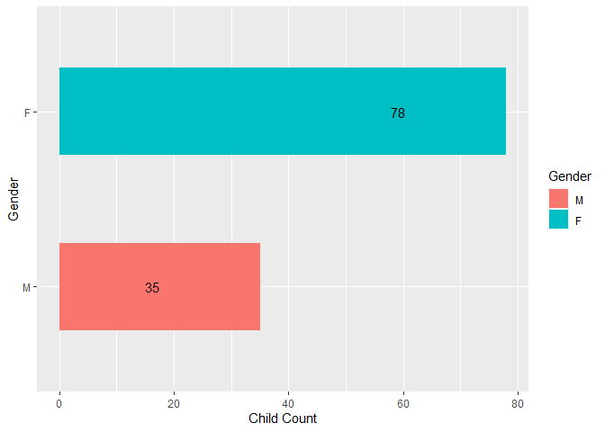<!-- -->

``` r
gender.xry <- table(cny$GENDER, cny$RUNS)
gender.xry
```

    ##    
    ##     Not Runaway Runaway
    ##   F        1317      78
    ##   M        1419      35

``` r
chisq.test(cny$GENDER, cny$RUNS, correct=FALSE)
```

    ## 
    ##  Pearson's Chi-squared test
    ## 
    ## data:  cny$GENDER and cny$RUNS
    ## X-squared = 18.952, df = 1, p-value = 1.341e-05

Ethnicity: Not Dependent

``` r
ethnicity.xry_freqtable <- sort(table(cny.xry$ETHNIC2))
ethnicity.xry_df <- as.data.frame(ethnicity.xry_freqtable)
colnames(ethnicity.xry_df) <- c("Ethnicity", "Child Count")
ethnicity.xry_df
```

    ##   Ethnicity Child Count
    ## 1        OT          26
    ## 2        WH          28
    ## 3        BL          59

``` r
ggplot(data = ethnicity.xry_df, aes(x=`Ethnicity`, y=`Child Count`)) +geom_bar(stat="identity", aes(fill=`Ethnicity`), width= 0.5) + coord_flip() + geom_text(aes(label=`Child Count`), hjust = 8)
```

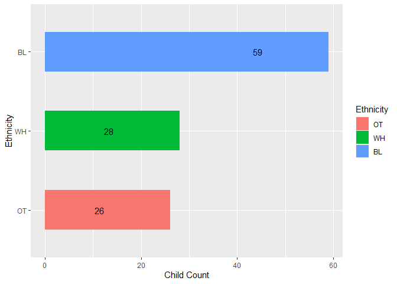<!-- -->

``` r
ethnicity.xry <- table(cny$ETHNIC2, cny$RUNS)
ethnicity.xry
```

    ##     
    ##      Not Runaway Runaway
    ##   BL        1184      59
    ##   OT         584      26
    ##   WH         968      28

``` r
chisq.test(cny$ETHNIC2, cny$RUNS, correct=FALSE)
```

    ## 
    ##  Pearson's Chi-squared test
    ## 
    ## data:  cny$ETHNIC2 and cny$RUNS
    ## X-squared = 5.6158, df = 2, p-value = 0.06033

Age Category: Dependent

``` r
agecat.xry_freqtable <- sort(table(cny.xry$AGECAT7))
round(prop.table(agecat.xry_freqtable),2)
```

    ## 
    ##     0 years   1-2 years   3-5 years   6-8 years  9-11 years 18-23 years 
    ##        0.00        0.00        0.00        0.00        0.00        0.02 
    ## 12-14 years 15-17 years 
    ##        0.32        0.66

``` r
agecat.xry_df <- as.data.frame(agecat.xry_freqtable)
colnames(agecat.xry_df) <- c("Age Category", "Child Count")
agecat.xry_df
```

    ##   Age Category Child Count
    ## 1      0 years           0
    ## 2    1-2 years           0
    ## 3    3-5 years           0
    ## 4    6-8 years           0
    ## 5   9-11 years           0
    ## 6  18-23 years           2
    ## 7  12-14 years          36
    ## 8  15-17 years          75

``` r
ggplot(data = agecat.xry_df, aes(x=`Age Category`, y=`Child Count`)) +geom_bar(stat="identity", aes(fill=`Age Category`), width= 0.5) + coord_flip() + geom_text(aes(label=`Child Count`), hjust = 8)
```

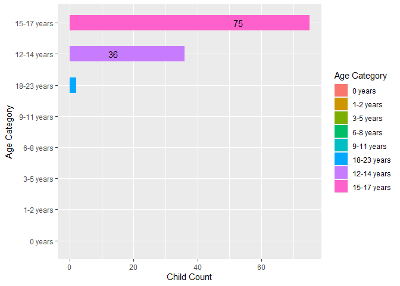<!-- -->

``` r
agecat.xry <- table(cny$AGECAT7, cny$RUNS)
agecat.xry
```

    ##              
    ##               Not Runaway Runaway
    ##   0 years             582       0
    ##   1-2 years           397       0
    ##   12-14 years         340      36
    ##   15-17 years         382      75
    ##   18-23 years          18       2
    ##   3-5 years           440       0
    ##   6-8 years           314       0
    ##   9-11 years          263       0

``` r
chisq.test(cny$AGECAT7, cny$RUNS, correct=FALSE)
```

    ## Warning in chisq.test(cny$AGECAT7, cny$RUNS, correct = FALSE): Chi-squared
    ## approximation may be incorrect

    ## 
    ##  Pearson's Chi-squared test
    ## 
    ## data:  cny$AGECAT7 and cny$RUNS
    ## X-squared = 301.22, df = 7, p-value < 2.2e-16

Hispanic: Dependent

``` r
hispanic.xry_freqtable <- sort(table(cny.xry$HISPANIC))
hispanic.xry_df <- as.data.frame(hispanic.xry_freqtable)
colnames(hispanic.xry_df) <- c("Hispanic", "Child Count")
hispanic.xry_df
```

    ##   Hispanic Child Count
    ## 1        Y           1
    ## 2        U          39
    ## 3        N          73

``` r
ggplot(data = hispanic.xry_df, aes(x=`Hispanic`, y=`Child Count`)) +geom_bar(stat="identity", aes(fill=`Hispanic`), width= 0.5) + coord_flip() + geom_text(aes(label=`Child Count`), hjust = 8)
```

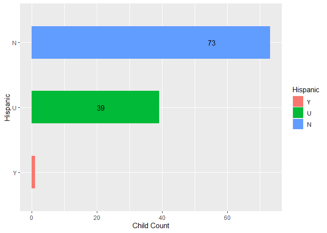<!-- -->

``` r
hispanic.xry <- table(cny$HISPANIC, cny$RUNS)
hispanic.xry
```

    ##    
    ##     Not Runaway Runaway
    ##   N        2032      73
    ##   U         611      39
    ##   Y          93       1

``` r
chisq.test(cny$HISPANIC, cny$RUNS, correct=FALSE)
```

    ## Warning in chisq.test(cny$HISPANIC, cny$RUNS, correct = FALSE): Chi-squared
    ## approximation may be incorrect

    ## 
    ##  Pearson's Chi-squared test
    ## 
    ## data:  cny$HISPANIC and cny$RUNS
    ## X-squared = 10.51, df = 2, p-value = 0.005223

INYEAR: First year of service: Dependent

``` r
inyear.xry_freqtable <- sort(table(cny.xry$INYEAR))
inyear.xry_df <- as.data.frame(inyear.xry_freqtable)
colnames(inyear.xry_df) <- c("In Year", "Child Count")
inyear.xry_df
```

    ##   In Year Child Count
    ## 1    2016          11
    ## 2    2015          42
    ## 3    2014          60

``` r
ggplot(data = inyear.xry_df, aes(x=`In Year`, y=`Child Count`)) +geom_bar(stat="identity", aes(fill=`In Year`), width= 0.5) + coord_flip() + geom_text(aes(label=`Child Count`), hjust = 5)
```

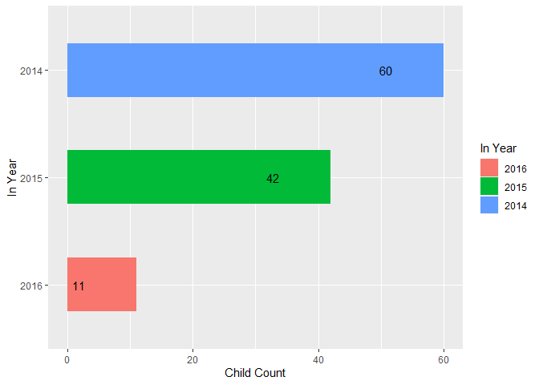<!-- -->

``` r
inyear.xry <- table(cny$INYEAR, cny$RUNS)
inyear.xry
```

    ##       
    ##        Not Runaway Runaway
    ##   2014         922      60
    ##   2015         927      42
    ##   2016         887      11

``` r
chisq.test(cny$INYEAR, cny$RUNS, correct=FALSE)
```

    ## 
    ##  Pearson's Chi-squared test
    ## 
    ## data:  cny$INYEAR and cny$RUNS
    ## X-squared = 29.909, df = 2, p-value = 3.201e-07

\#Spell-related fields

OM: Month spell ended : Dependent

``` r
om.xry_freqtable <- sort(table(cny.xry$OM))
om.xry_df <- as.data.frame(om.xry_freqtable)
colnames(om.xry_df) <- c("Month Spell Ended", "Child Count")
om.xry_df
```

    ##    Month Spell Ended Child Count
    ## 1                Jul           5
    ## 2                Aug           7
    ## 3                Feb           7
    ## 4                Apr           8
    ## 5                Nov           9
    ## 6                Oct           9
    ## 7                Sep           9
    ## 8                Dec          10
    ## 9                Mar          10
    ## 10               May          10
    ## 11               Jan          13
    ## 12               Jun          16

``` r
ggplot(data = om.xry_df, aes(x=`Month Spell Ended`, y=`Child Count`)) +geom_bar(stat="identity", aes(fill=`Child Count`), width= 0.5) + coord_flip() + geom_text(aes(label=`Child Count`), hjust = 8)
```

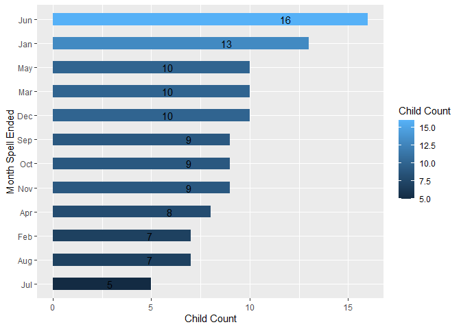<!-- -->

``` r
om.xry <- table(cny$OM, cny$RUNS)
om.xry
```

    ##      
    ##       Not Runaway Runaway
    ##   Apr         122       8
    ##   Aug         142       7
    ##   Dec         154      10
    ##   Feb          87       7
    ##   Jan        1188      13
    ##   Jul         156       5
    ##   Jun         155      16
    ##   Mar         117      10
    ##   May         122      10
    ##   Nov         176       9
    ##   Oct         181       9
    ##   Sep         136       9

``` r
chisq.test(cny$OM, cny$RUNS, correct=FALSE)
```

    ## Warning in chisq.test(cny$OM, cny$RUNS, correct = FALSE): Chi-squared
    ## approximation may be incorrect

    ## 
    ##  Pearson's Chi-squared test
    ## 
    ## data:  cny$OM and cny$RUNS
    ## X-squared = 58.575, df = 11, p-value = 1.704e-08

IM: Month spell began

``` r
im.xry_freqtable <- sort(table(cny.xry$IM))
im.xry_df <- as.data.frame(im.xry_freqtable)
colnames(im.xry_df) <- c("Month Spell Began", "Child Count")
im.xry_df
```

    ##    Month Spell Began Child Count
    ## 1                Sep           5
    ## 2                Aug           6
    ## 3                Jun           6
    ## 4                Jul           7
    ## 5                Mar           8
    ## 6                Oct           8
    ## 7                Dec           9
    ## 8                Apr          10
    ## 9                Nov          10
    ## 10               May          12
    ## 11               Feb          16
    ## 12               Jan          16

``` r
ggplot(data = im.xry_df, aes(x=`Month Spell Began`, y=`Child Count`)) +geom_bar(stat="identity", aes(fill=`Child Count`), width= 0.5) + coord_flip() + geom_text(aes(label=`Child Count`), hjust = 8)
```

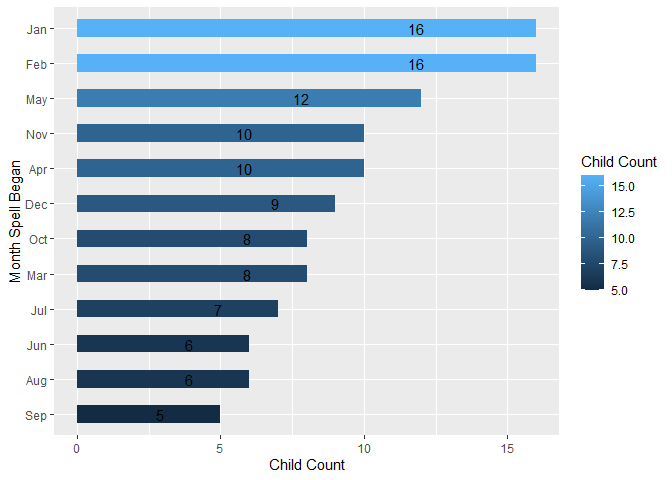<!-- -->

``` r
im.xry <- table(cny$IM, cny$RUNS)
im.xry
```

    ##      
    ##       Not Runaway Runaway
    ##   Apr         234      10
    ##   Aug         295       6
    ##   Dec         185       9
    ##   Feb         170      16
    ##   Jan         210      16
    ##   Jul         252       7
    ##   Jun         235       6
    ##   Mar         220       8
    ##   May         208      12
    ##   Nov         216      10
    ##   Oct         266       8
    ##   Sep         245       5

``` r
chisq.test(cny$IM, cny$RUNS, correct=FALSE)
```

    ## 
    ##  Pearson's Chi-squared test
    ## 
    ## data:  cny$IM and cny$RUNS
    ## X-squared = 26.884, df = 11, p-value = 0.004785

Primary PLacement Type: Dependent

``` r
type.xry <- table(cny$TYPE, cny$RUNS)
type.xry
```

    ##                                   
    ##                                    Not Runaway Runaway
    ##   Alternative Placement                     44       4
    ##   Foster Care                              468       2
    ##   Group Home                                71      14
    ##   Independent Living                        15       5
    ##   Kinship Care                            1494      20
    ##   MX                                        28       4
    ##   Residential Care                          44       8
    ##   Residential Treatment Facilities          13       2
    ##   Shelter Foster Care                      266       2
    ##   Shelter Group Home                       230      51
    ##   Unknown                                   63       1

``` r
chisq.test(cny$TYPE, cny$RUNS, correct=FALSE)
```

    ## Warning in chisq.test(cny$TYPE, cny$RUNS, correct = FALSE): Chi-squared
    ## approximation may be incorrect

    ## 
    ##  Pearson's Chi-squared test
    ## 
    ## data:  cny$TYPE and cny$RUNS
    ## X-squared = 287.85, df = 10, p-value < 2.2e-16

``` r
type.tab <- table(cny$RUNS, cny$TYPE)
type.tab
```

    ##              
    ##               Alternative Placement Foster Care Group Home Independent Living
    ##   Not Runaway                    44         468         71                 15
    ##   Runaway                         4           2         14                  5
    ##              
    ##               Kinship Care   MX Residential Care
    ##   Not Runaway         1494   28               44
    ##   Runaway               20    4                8
    ##              
    ##               Residential Treatment Facilities Shelter Foster Care
    ##   Not Runaway                               13                 266
    ##   Runaway                                    2                   2
    ##              
    ##               Shelter Group Home Unknown
    ##   Not Runaway                230      63
    ##   Runaway                     51       1

Last Placement Type: Dependent

``` r
lastplace.xry <- table(cny$LASTPLACE, cny$RUNS)
lastplace.xry
```

    ##      
    ##       Not Runaway Runaway
    ##   PAL          44       4
    ##   PFC         483       1
    ##   PGH          79      21
    ##   PIL          23       5
    ##   PKC        1487      20
    ##   PRC          55       8
    ##   PRT          12       0
    ##   PSF         246       1
    ##   PSG         220      52
    ##   PUK          87       1

``` r
chisq.test(cny$LASTPLACE, cny$RUNS, correct=FALSE)
```

    ## Warning in chisq.test(cny$LASTPLACE, cny$RUNS, correct = FALSE): Chi-squared
    ## approximation may be incorrect

    ## 
    ##  Pearson's Chi-squared test
    ## 
    ## data:  cny$LASTPLACE and cny$RUNS
    ## X-squared = 325.39, df = 9, p-value < 2.2e-16

``` r
lastplace.tab <- table(cny$RUNS, cny$LASTPLACE)
lastplace.tab
```

    ##              
    ##                PAL  PFC  PGH  PIL  PKC  PRC  PRT  PSF  PSG  PUK
    ##   Not Runaway   44  483   79   23 1487   55   12  246  220   87
    ##   Runaway        4    1   21    5   20    8    0    1   52    1

Reenter: Dependent

``` r
lastplace.xry <- table(cny$LASTPLACE, cny$RUNS)
lastplace.xry
```

    ##      
    ##       Not Runaway Runaway
    ##   PAL          44       4
    ##   PFC         483       1
    ##   PGH          79      21
    ##   PIL          23       5
    ##   PKC        1487      20
    ##   PRC          55       8
    ##   PRT          12       0
    ##   PSF         246       1
    ##   PSG         220      52
    ##   PUK          87       1

``` r
chisq.test(cny$LASTPLACE, cny$RUNS, correct=FALSE)
```

    ## Warning in chisq.test(cny$LASTPLACE, cny$RUNS, correct = FALSE): Chi-squared
    ## approximation may be incorrect

    ## 
    ##  Pearson's Chi-squared test
    ## 
    ## data:  cny$LASTPLACE and cny$RUNS
    ## X-squared = 325.39, df = 9, p-value < 2.2e-16

``` r
lastplace.tab <- table(cny$RUNS, cny$LASTPLACE)
lastplace.tab
```

    ##              
    ##                PAL  PFC  PGH  PIL  PKC  PRC  PRT  PSF  PSG  PUK
    ##   Not Runaway   44  483   79   23 1487   55   12  246  220   87
    ##   Runaway        4    1   21    5   20    8    0    1   52    1

Regression and Random Forest

``` r
cny.new <- cny
cny.new$ID <- NULL
cny.new$ST_CNTYNAME <- NULL
cny.new$START <- NULL
cny.new$STOP <- NULL
cny.new$PLACE2_DATE <- NULL
cny.new$RECAT <- NULL
cny.new$IYMO <- NULL
cny.new$OYMO <- NULL
cny.new$DURAT <- NULL
cny.new$DURMO <- NULL
cny.new$SPELL <- NULL
cny.new$PLACE2 <- NULL
cny.new$EXIT <- NULL
```

``` r
cny.new<- transform(cny.new,
                RUNS = as.factor(mapvalues(RUNS,c(1,0),c("Runaway","Not Runaway"))),
                AGE_20161231 = as.factor(AGE_20161231),
                SPELLAGE = as.factor(SPELLAGE),
                SPELLONE = as.factor(mapvalues(SPELLONE,c(1,0),c("First Spell","Not First Spell"))),
                INYEAR = as.factor(mapvalues(INYEAR, c(2014,2015,2016),c("2014","2015","2016"))),  
                LEVELCHG = as.factor(mapvalues(LEVELCHG, c(0,1),c("0","1"))),
                DISCH = as.factor(mapvalues(DISCH, c(0,1),c("0","1"))),
                REENTER = as.factor(mapvalues(REENTER, c(0,1),c("0","1"))),
                NPLACES = as.factor(mapvalues(NPLACES, c(1,2,3,4,5,6,7,8,9,11,13),c("1","2","3","4","5","6","7","8","9","11","13"))),
                MOVES = as.factor(mapvalues(MOVES, c(0,1,2,3,4,5,6,7,8,10,12),c("0","1","2","3","4","5","6","7","8","10","12"))),
                AGECAT7 = as.factor(mapvalues(AGECAT7, c(1,2,3,4,5,6,7), c("0 years","1-2 years","3-5 years", "6-8 years","9-11 years","12-14 years","15-17 years"))),
                DURCAT = as.factor(mapvalues(DURCAT, c(1,2,3,4,5,6), c("1-29 days","30-89 days","90-179 days", "180-364 days","365-544 days","545-1094 days"))), 
                TYPE = as.factor(mapvalues(TYPE, c("AL","FC","GH","IL","KC","RC", "RT","SF","SG","UK"), c("Alternative Placement","Foster Care","Group Home", "Independent Living","Kinship Care","Residential Care","Residential Treatment Facilities","Shelter Foster Care","Shelter Group Home","Unknown"))),
                IM = as.factor(mapvalues(IM, c(1,2,3,4,5,6,7,8,9,10,11,12),c("Jan","Feb","Mar","Apr","May","Jun","Jul","Aug","Sep","Oct","Nov","Dec"))),
                IY = as.factor(mapvalues(IY,c(2014,2015,2016),c("2014","2015","2016"))),
                OM = as.factor(mapvalues(OM, c(1,2,3,4,5,6,7,8,9,10,11,12),c("Jan","Feb","Mar","Apr","May","Jun","Jul","Aug","Sep","Oct","Nov","Dec"))),
                OY = as.factor(mapvalues(OY,c(2014,2015,2016,2017),c("2014","2015","2016","2017"))))
```

    ## The following `from` values were not present in `x`: 1, 0
    ## The following `from` values were not present in `x`: 1, 0

    ## The following `from` values were not present in `x`: 1, 2, 3, 4, 5, 6, 7

    ## The following `from` values were not present in `x`: 1, 2, 3, 4, 5, 6

    ## The following `from` values were not present in `x`: AL, FC, GH, IL, KC, RC, RT, SF, SG, UK

    ## The following `from` values were not present in `x`: 1, 2, 3, 4, 5, 6, 7, 8, 9, 10, 11, 12
    ## The following `from` values were not present in `x`: 1, 2, 3, 4, 5, 6, 7, 8, 9, 10, 11, 12

``` r
ncol(cny.new)
```

    ## [1] 24

``` r
str(cny.new)
```

    ## 'data.frame':    2849 obs. of  24 variables:
    ##  $ ï..ID       : num  3e+09 3e+09 3e+09 3e+09 3e+09 ...
    ##  $ GENDER      : chr  "F" "M" "M" "M" ...
    ##  $ HISPANIC    : chr  "U" "U" "N" "N" ...
    ##  $ ETHNIC      : chr  "WH" "BL" "WH" "BL" ...
    ##  $ ETHNIC2     : chr  "WH" "BL" "WH" "BL" ...
    ##  $ AGE_20161231: Factor w/ 24 levels "0","1","2","3",..: 21 8 4 7 6 21 3 7 4 20 ...
    ##  $ AGECAT7     : Factor w/ 8 levels "0 years","1-2 years",..: 4 6 1 6 2 4 1 6 1 4 ...
    ##  $ SPELLAGE    : Factor w/ 21 levels "0","1","2","3",..: 18 5 1 5 3 18 1 4 1 17 ...
    ##  $ INYEAR      : Factor w/ 3 levels "2014","2015",..: 1 1 1 1 1 1 1 1 1 1 ...
    ##  $ SPELLONE    : Factor w/ 2 levels "First Spell",..: 1 1 1 1 1 1 1 1 1 1 ...
    ##  $ TYPE        : Factor w/ 11 levels "Alternative Placement",..: 10 5 5 2 5 10 2 5 2 3 ...
    ##  $ PLACE1      : chr  "PSG" "PKC" "PKC" "PFC" ...
    ##  $ LASTPLACE   : chr  "PSG" "PKC" "PKC" "PFC" ...
    ##  $ LEVELCHG    : Factor w/ 2 levels "0","1": 1 1 1 1 1 1 1 1 2 2 ...
    ##  $ NPLACES     : Factor w/ 11 levels "1","11","13",..: 1 1 1 1 1 1 1 1 6 4 ...
    ##  $ MOVES       : Factor w/ 11 levels "0","1","10","12",..: 1 1 1 1 1 1 1 1 6 2 ...
    ##  $ DISCH       : Factor w/ 2 levels "0","1": 2 2 2 2 2 2 2 2 2 2 ...
    ##  $ RUNS        : Factor w/ 2 levels "Not Runaway",..: 1 1 1 1 1 1 1 1 1 2 ...
    ##  $ REENTER     : Factor w/ 2 levels "0","1": 1 1 2 1 1 1 2 2 1 2 ...
    ##  $ DURCAT      : Factor w/ 6 levels "1-29 days","180-364 days",..: 6 3 3 5 5 1 1 6 5 3 ...
    ##  $ IM          : Factor w/ 12 levels "Apr","Aug","Dec",..: 5 5 5 5 5 5 5 5 5 5 ...
    ##  $ IY          : Factor w/ 3 levels "2014","2015",..: 1 1 1 1 1 1 1 1 1 1 ...
    ##  $ OM          : Factor w/ 12 levels "Apr","Aug","Dec",..: 1 8 4 2 2 5 5 7 10 8 ...
    ##  $ OY          : Factor w/ 4 levels "2014","2015",..: 1 1 1 3 3 1 1 1 3 1 ...

``` r
random.forest.output<- randomForest(RUNS ~ ., data = cny.new, na.action = na.omit)
random.forest.output
```

    ## 
    ## Call:
    ##  randomForest(formula = RUNS ~ ., data = cny.new, na.action = na.omit) 
    ##                Type of random forest: classification
    ##                      Number of trees: 500
    ## No. of variables tried at each split: 4
    ## 
    ##         OOB estimate of  error rate: 4.04%
    ## Confusion matrix:
    ##             Not Runaway Runaway class.error
    ## Not Runaway        2716      20 0.007309942
    ## Runaway              95      18 0.840707965

``` r
vi_f = importance(random.forest.output)
vi_f
```

    ##              MeanDecreaseGini
    ## ï..ID               16.768128
    ## GENDER               3.922304
    ## HISPANIC             3.705462
    ## ETHNIC               4.822217
    ## ETHNIC2              4.307604
    ## AGE_20161231        19.947871
    ## AGECAT7              6.967032
    ## SPELLAGE            17.097914
    ## INYEAR               4.197597
    ## SPELLONE             9.003012
    ## TYPE                14.157879
    ## PLACE1               7.110827
    ## LASTPLACE            6.422674
    ## LEVELCHG             1.537221
    ## NPLACES              5.703903
    ## MOVES                6.215198
    ## DISCH                2.774001
    ## REENTER             11.971663
    ## DURCAT              10.131590
    ## IM                  23.028311
    ## IY                   3.936656
    ## OM                  23.682455
    ## OY                   7.537551

``` r
varImpPlot(random.forest.output,type=2)
```

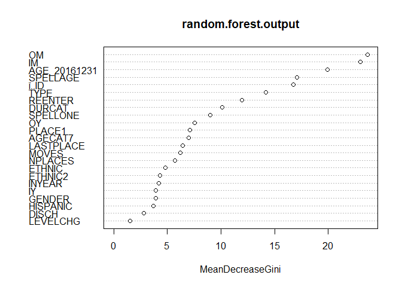<!-- -->

``` r
x <- glm(RUNS ~ OM + TYPE + REENTER + DURCAT + ETHNIC2 + GENDER, binomial,data =cny.new)
summary(x)
```

    ## 
    ## Call:
    ## glm(formula = RUNS ~ OM + TYPE + REENTER + DURCAT + ETHNIC2 + 
    ##     GENDER, family = binomial, data = cny.new)
    ## 
    ## Deviance Residuals: 
    ##     Min       1Q   Median       3Q      Max  
    ## -1.5068  -0.1965  -0.1153  -0.0742   3.2578  
    ## 
    ## Coefficients:
    ##                                       Estimate Std. Error z value Pr(>|z|)    
    ## (Intercept)                          -1.542539   0.758209  -2.034 0.041906 *  
    ## OMAug                                -0.369891   0.598353  -0.618 0.536456    
    ## OMDec                                 0.212421   0.557967   0.381 0.703422    
    ## OMFeb                                 0.055460   0.616450   0.090 0.928314    
    ## OMJan                                -0.961077   0.514677  -1.867 0.061854 .  
    ## OMJul                                -0.526200   0.645618  -0.815 0.415054    
    ## OMJun                                 0.041599   0.517424   0.080 0.935922    
    ## OMMar                                 0.074105   0.562909   0.132 0.895263    
    ## OMMay                                 0.238622   0.563887   0.423 0.672169    
    ## OMNov                                 0.001119   0.574740   0.002 0.998447    
    ## OMOct                                -0.053069   0.562192  -0.094 0.924794    
    ## OMSep                                 0.243985   0.583412   0.418 0.675799    
    ## TYPEFoster Care                      -3.393237   0.918050  -3.696 0.000219 ***
    ## TYPEGroup Home                       -0.337617   0.666584  -0.506 0.612513    
    ## TYPEIndependent Living                0.843427   0.823537   1.024 0.305763    
    ## TYPEKinship Care                     -2.329151   0.615026  -3.787 0.000152 ***
    ## TYPEMX                                0.377286   0.844097   0.447 0.654896    
    ## TYPEResidential Care                 -0.399576   0.719670  -0.555 0.578743    
    ## TYPEResidential Treatment Facilities  0.242620   0.995512   0.244 0.807453    
    ## TYPEShelter Foster Care              -3.461957   0.929864  -3.723 0.000197 ***
    ## TYPEShelter Group Home               -0.432558   0.622112  -0.695 0.486864    
    ## TYPEUnknown                          -2.399159   1.200264  -1.999 0.045624 *  
    ## REENTER1                              1.808408   0.240729   7.512 5.81e-14 ***
    ## DURCAT180-364 days                   -0.109142   0.384387  -0.284 0.776459    
    ## DURCAT30-89 days                     -0.162024   0.313294  -0.517 0.605041    
    ## DURCAT365-544 days                   -0.730869   0.620904  -1.177 0.239154    
    ## DURCAT545-1094 days                  -0.360473   0.566475  -0.636 0.524552    
    ## DURCAT90-179 days                    -0.108015   0.359377  -0.301 0.763749    
    ## ETHNIC2OT                             0.316821   0.278449   1.138 0.255202    
    ## ETHNIC2WH                            -0.126239   0.265689  -0.475 0.634688    
    ## GENDERM                              -0.890242   0.235169  -3.786 0.000153 ***
    ## ---
    ## Signif. codes:  0 '***' 0.001 '**' 0.01 '*' 0.05 '.' 0.1 ' ' 1
    ## 
    ## (Dispersion parameter for binomial family taken to be 1)
    ## 
    ##     Null deviance: 950.84  on 2848  degrees of freedom
    ## Residual deviance: 632.58  on 2818  degrees of freedom
    ## AIC: 694.58
    ## 
    ## Number of Fisher Scoring iterations: 8

``` r
cny.kc <- filter(cny,TYPE=="Kinship Care")
cny.fc <- filter(cny,TYPE=="Foster Care")
cny.sg <- filter(cny,TYPE=="Shelter Group Home")
cny.il <- filter(cny, TYPE == "Independent Living")
```

``` r
cny.jan <- filter(cny, OM == "Jan", AGECAT7 == "12-14 years" | AGECAT7 == "15-17 years" |AGECAT7 == "18-23 years", RUNS=="Runaway")
cny.feb <- filter(cny, OM == "Feb", AGECAT7 == "12-14 years" | AGECAT7 == "15-17 years" |AGECAT7 == "18-23 years" ,RUNS=="Runaway")
cny.mar <- filter(cny, OM == "Mar", AGECAT7 == "12-14 years" | AGECAT7 == "15-17 years" |AGECAT7 == "18-23 years", RUNS=="Runaway")
cny.apr <- filter(cny, OM == "Apr", AGECAT7 == "12-14 years" | AGECAT7 == "15-17 years" |AGECAT7 == "18-23 years",RUNS=="Runaway")
cny.may<- filter(cny, OM == "May", AGECAT7 == "12-14 years" | AGECAT7 == "15-17 years" |AGECAT7 == "18-23 years", RUNS=="Runaway")
cny.jun <- filter(cny, OM == "Jun", AGECAT7 == "12-14 years" | AGECAT7 == "15-17 years" |AGECAT7 == "18-23 years", RUNS=="Runaway")
cny.jul <- filter(cny, OM == "Jul", AGECAT7 == "12-14 years" | AGECAT7 == "15-17 years" |AGECAT7 == "18-23 years", RUNS=="Runaway")
cny.aug <- filter(cny, OM == "Aug", AGECAT7 == "12-14 years" | AGECAT7 == "15-17 years" |AGECAT7 == "18-23 years", RUNS=="Runaway")
cny.sep <- filter(cny, OM == "Sep", AGECAT7 == "12-14 years" | AGECAT7 == "15-17 years" |AGECAT7 == "18-23 years", RUNS=="Runaway")
cny.oct<- filter(cny, OM == "Oct", AGECAT7 == "12-14 years" | AGECAT7 == "15-17 years" |AGECAT7 == "18-23 years", RUNS=="Runaway")
cny.nov <- filter(cny, OM == "Nov", AGECAT7 == "12-14 years" | AGECAT7 == "15-17 years" |AGECAT7 == "18-23 years", RUNS=="Runaway")
cny.dec <- filter(cny, OM == "Dec", AGECAT7 == "12-14 years" | AGECAT7 == "15-17 years" |AGECAT7 == "18-23 years",RUNS=="Runaway")
```

``` r
nrow(cny.jan)
```

    ## [1] 13

``` r
nrow(cny.feb)
```

    ## [1] 7

``` r
nrow(cny.mar)
```

    ## [1] 10

``` r
nrow(cny.apr)
```

    ## [1] 8

``` r
nrow(cny.may)
```

    ## [1] 10

``` r
nrow(cny.jun)
```

    ## [1] 16

``` r
nrow(cny.jul)
```

    ## [1] 5

``` r
nrow(cny.aug)
```

    ## [1] 7

``` r
nrow(cny.sep)
```

    ## [1] 9

``` r
nrow(cny.oct)
```

    ## [1] 9

``` r
nrow(cny.nov)
```

    ## [1] 9

``` r
nrow(cny.dec)
```

    ## [1] 10
